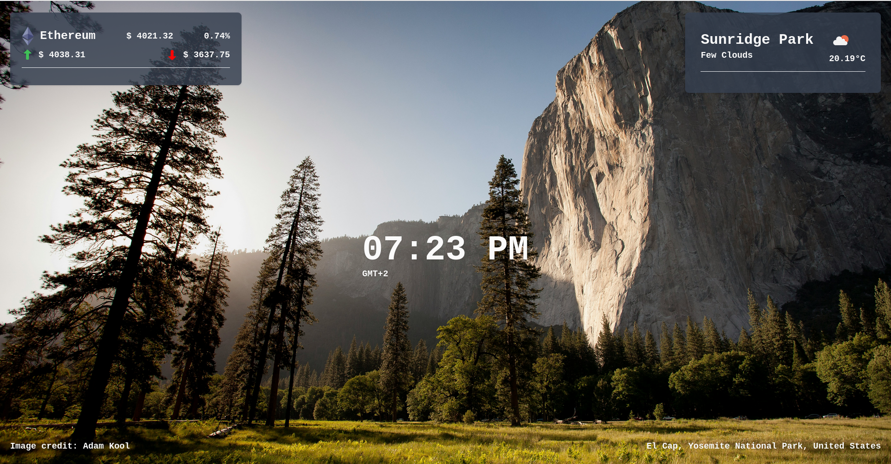
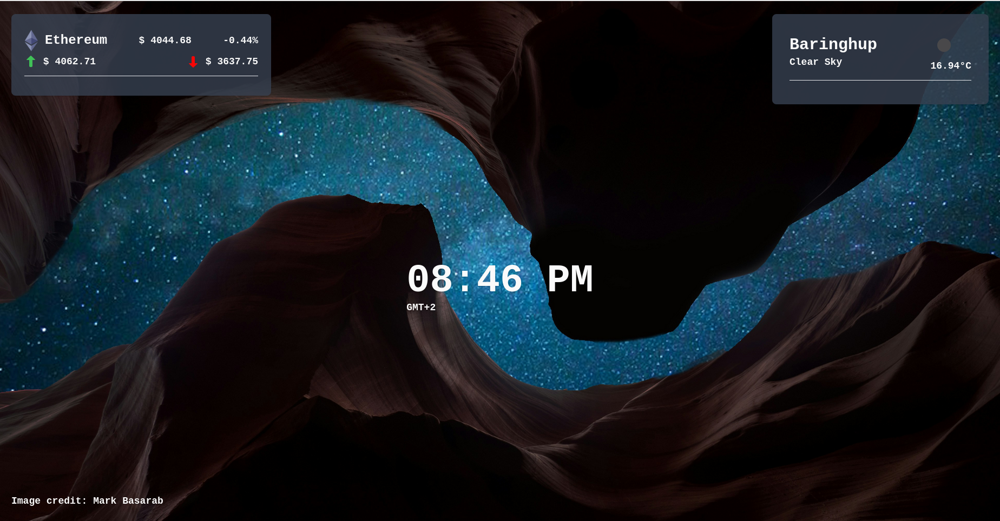
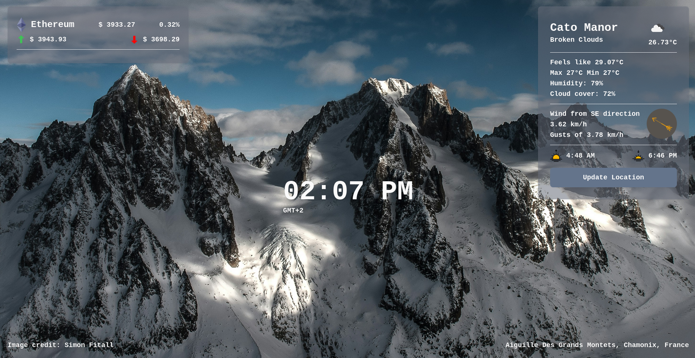
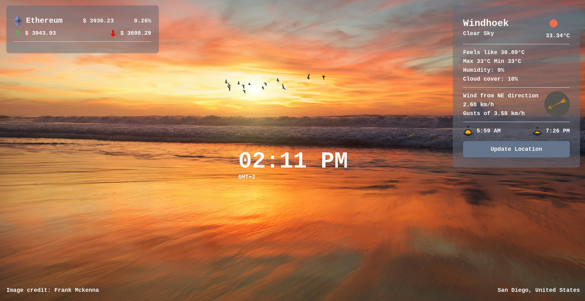
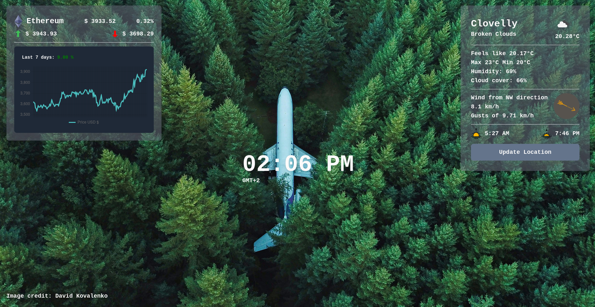
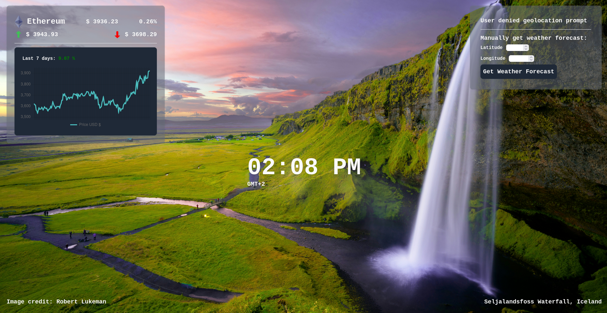

# Personal Dashboard Browser Extension

A personal dashboard on your new tab in the browser. Inspired by [MomentumDash](https://momentumdash.com/).

## Features
- Get weather data for current location automatically (requires user geolocation permission).
- Manual weather input fallback system based on coordinates (can be used to check weather data anywhere).
- Get latest financial data (hardcoded for Ethereum at this point in time), displaying 24-hour highs and lows, the current price, and last 7 days price movement.
- Updates data roughly ever hour.
- Displays a random high quality nature image as background.


## Setup
1. Clone this repo
2. Run `npm install` to get the necessary dependencies.
3. _Optional:_ If you intend to develop the code further, follow the **Usage** instructions, but place your `keys.js` file inside the `public` folder instead. When you run the build command, it will be bundled with the rest of the code.
4. Run  `npm run build` to generate the build files. By default this will be output to a folder called `dist/`.


## Usage
In order to make full use of this extension and access the OpenWeather API, you must:

1. Register a developer account on https://openweathermap.org/ and get your API key.
2. Create a file called `keys.js` in the root directory of the bundled code.
3. Place your key into this file and export it as "OpenWeatherKey" like this:
    ```javascript
    export const OpenWeatherKey = "your key here";
    ```
4. Zip the bundled contents, find and follow the instructions to load it as a browser extension for your preferred browser (Chrome, Firefox, Edge etc..).
5. Enjoy your cool new NewTab screen.


## Notes
This project was built as part of a bootcamp exercise, and extended beyond the initial criteria. Originally project was meant to run as a single sequential script in vanilla JS. Only recently ported to make use of a build manager (Vite). File structure currently reflects this (all logic in `index.js`)😅

## Examples

#### Basic View



#### Extended Weather Panel



#### All Extended Panels


#### Manual Weather Input
